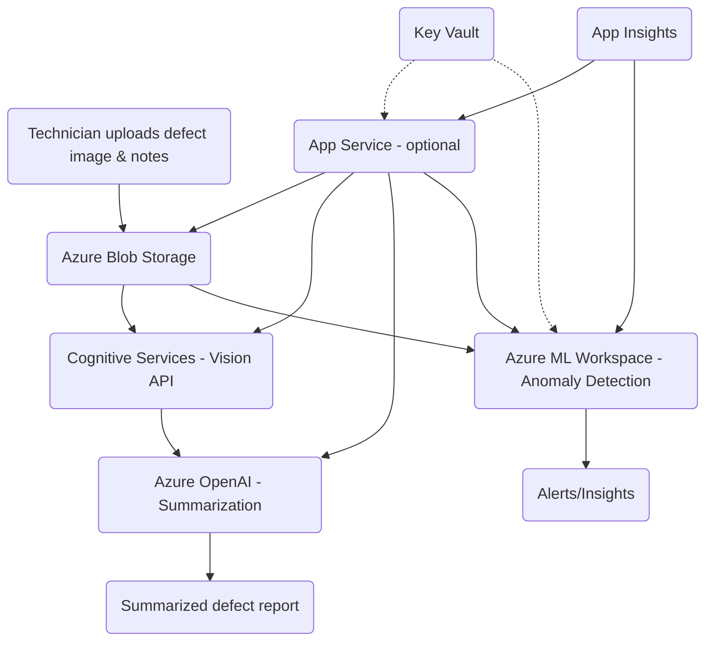
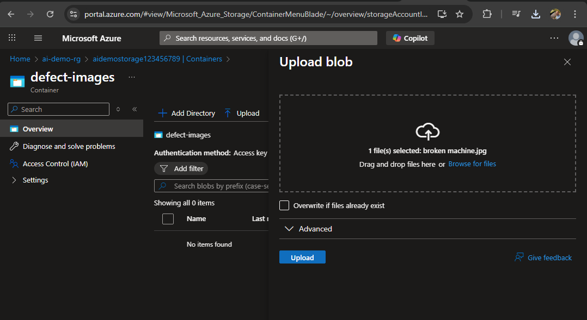
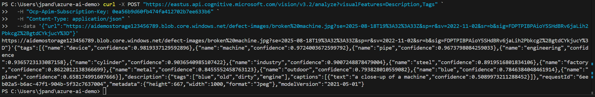
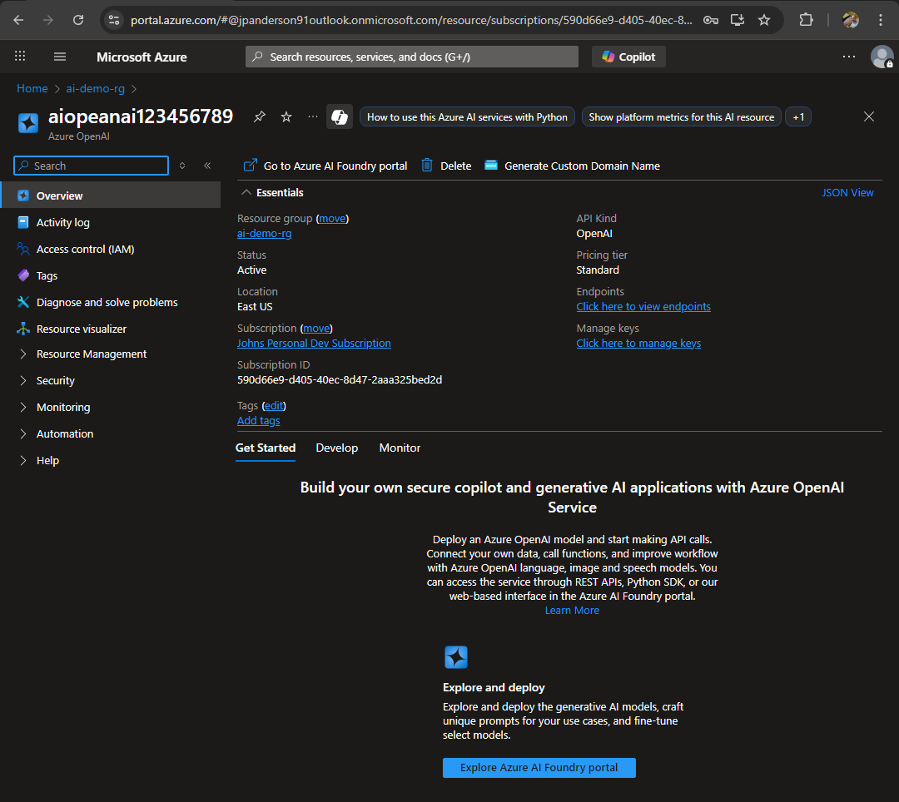
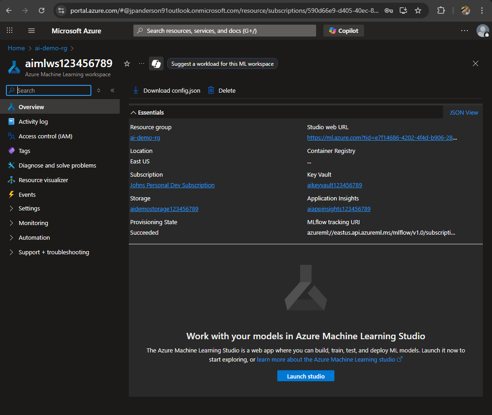
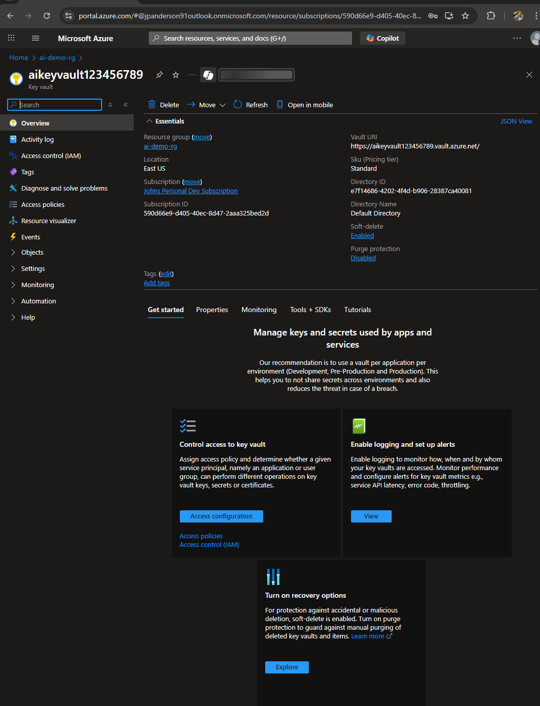
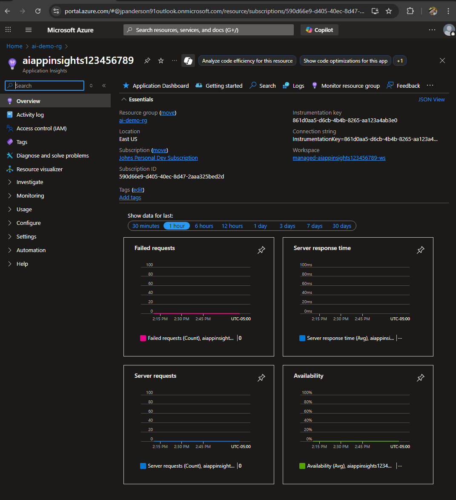
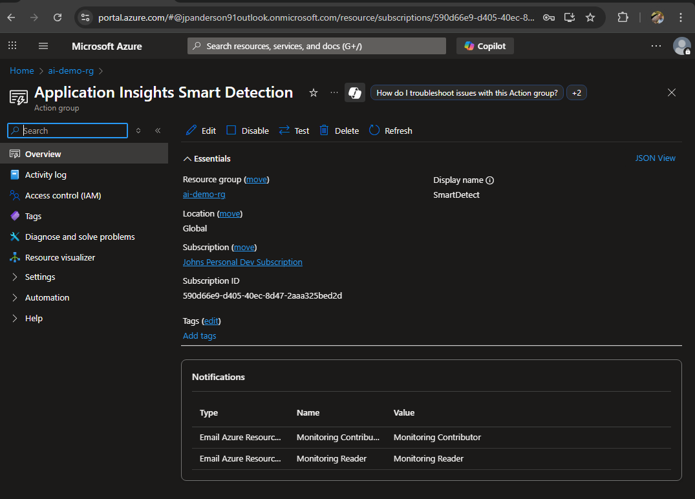
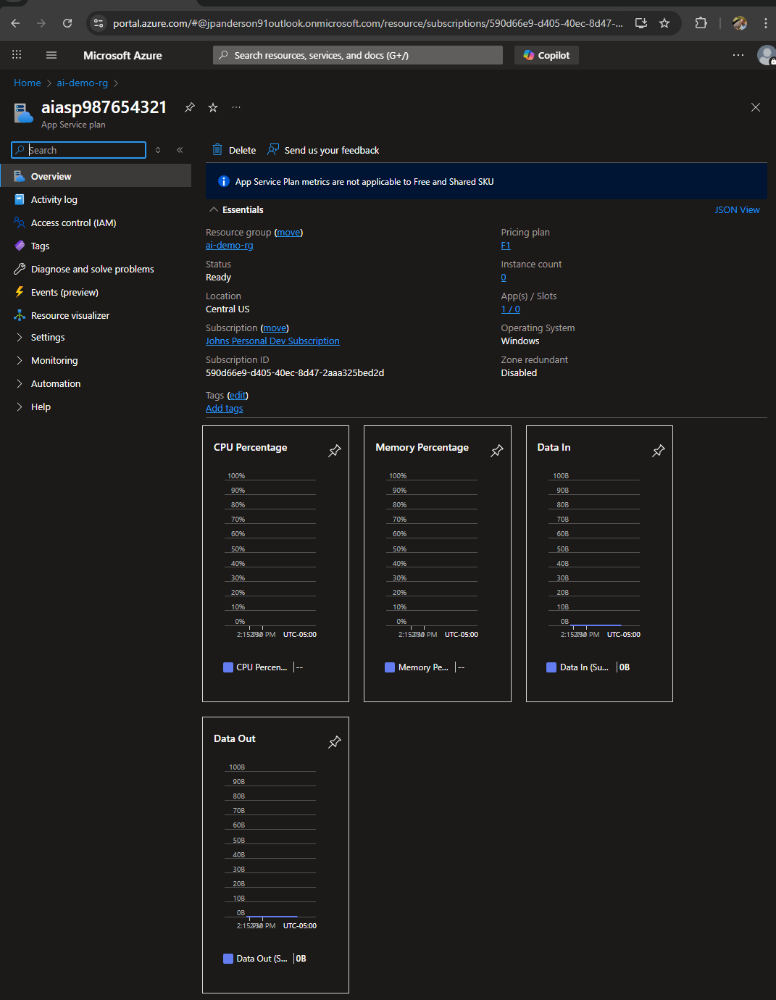
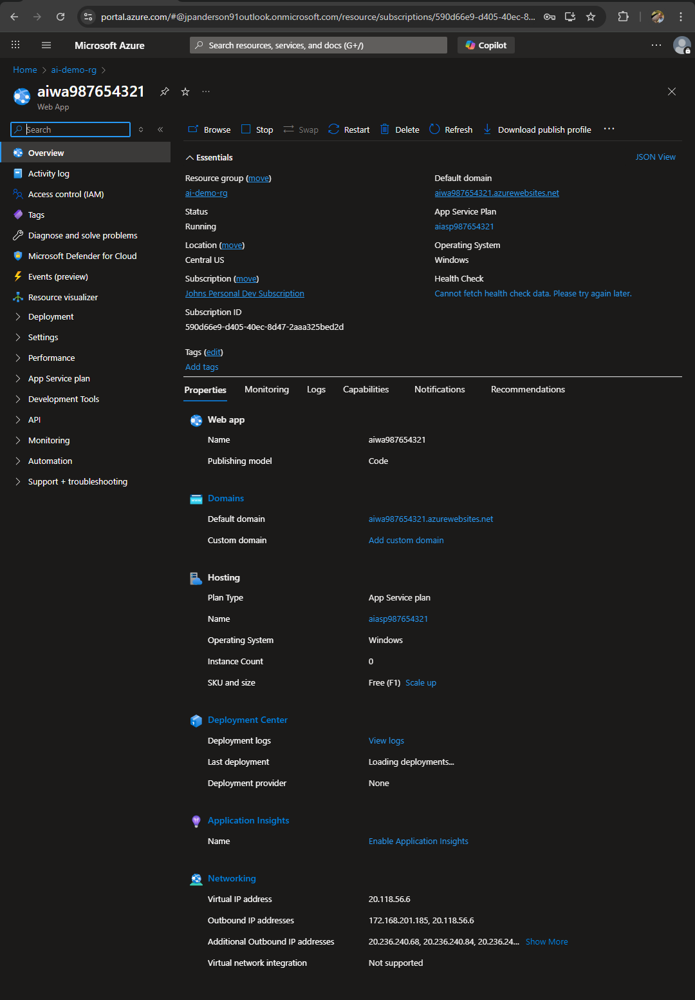

# Azure AI Integration Demo – Intelligent Defect Tracking for Manufacturing

## 🧠 Scenario Overview

This demo simulates a real-world engagement with a manufacturing customer who has developed an internal defect tracking application. The customer wants to enhance their solution by integrating Azure AI capabilities to:

- 📷 Analyze uploaded images of defective parts using **Azure Cognitive Services (Vision API)**
- 📝 Summarize technician notes using **Azure OpenAI (GPT-4)**
- ⚠️ Detect anomalies in defect patterns using a **custom ML model deployed via Azure ML**

As a Digital Solution Engineer, the goal is to guide the customer through secure, scalable integration of Azure AI into their existing application—accelerating productivity and unlocking new insights.

---

## 🏗️ Architecture Summary



| Component | Service | Purpose |
|----------|---------|---------|
| **Frontend App** | Azure Static Web Apps (optional) | Customer UI for defect submission |
| **Image Analysis** | Azure Cognitive Services – Vision API | Detect damage and classify part defects |
| **Text Summarization** | Azure OpenAI | Summarize technician notes for faster triage |
| **Anomaly Detection** | Azure ML | Flag unusual defect patterns using historical data |
| **Storage** | Azure Blob Storage | Store images and metadata securely |
| **Secrets Management** | Azure Key Vault | Secure API keys and connection strings |
| **Deployment** | ARM Templates | Infrastructure-as-code for repeatable setup |

---

## 📖 How This Solution Could Be Used

1. **Technician Submission:**  
   A technician uploads a photo of a faulty part and enters notes describing the issue using a simple upload interface.  
     
   After upload, the image appears in the `defect-images` container:  
   


2. **Automated Image Analysis:**  
   The technician’s uploaded image is automatically analyzed by Azure Cognitive Services (Vision API).  
   The screenshot below shows the API call and the AI-generated response, which includes:
   - **Tags:** The service identifies relevant features in the image (e.g., "device", "machine", "pipe", "engineering", "metal", etc.).
   - **Caption:** The AI generates a human-readable summary, such as "a close-up of a machine".

   

   The image analyzed in this step:  
   


3. **AI-Powered Summarization:**  
   The technician’s notes are sent to Azure OpenAI, which generates a concise summary for faster triage and reporting.  
   


4. **Anomaly Detection:**  
   All defect data is fed into a custom ML model in Azure ML Workspace. If an unusual pattern is detected (e.g., a spike in a certain defect type), the system flags it for review.  
   


5. **Secure & Monitored:**  
   All secrets (API keys, connection strings) are managed in Key Vault. Application Insights provides monitoring and diagnostics for the solution.  
     
     
   


6. **App Service Ready for Integration:**  
   The App Service is provisioned and ready to host the defect tracking application or API.  
     
   

---

**Business Impact:**  
- Reduces manual effort for defect triage  
- Accelerates root cause analysis  
- Enables proactive quality improvements
---

## 🚀 Features

- End-to-end AI integration using Azure-native services
- Infrastructure deployed via **ARM templates**
- Modular backend for image and text processing
- Simulated customer scenario with clear business impact
- Ready for extension into real-world POCs or workshops

---

## 📂 Repository Structure

```plaintext
azure-ai-demo/
├── arm-templates/
│   ├── app-service/
│   ├── cognitive-services/
│   ├── key-vault/
│   ├── ml-workspace/
│   ├── openai/
│   ├── resource-group/
│   └── storage-account/
├── docs/
│   └── screenshots/
│       ├── azure-ai-demo-app-service-plan.png
│       ├── azure-ai-demo-application-insights-smart-detection-action-group.png
│       ├── azure-ai-demo-application-insights.png
│       ├── azure-ai-demo-computer-vision.png
│       ├── azure-ai-demo-key-vault.png
│       ├── azure-ai-demo-ml-workspace.png
│       ├── azure-ai-demo-open-ai.png
│       ├── azure-ai-demo-resource-group.png
│       ├── azure-ai-demo-storage-account.png
│       └── azure-ai-demo-web-app.png
└── README.md
```
