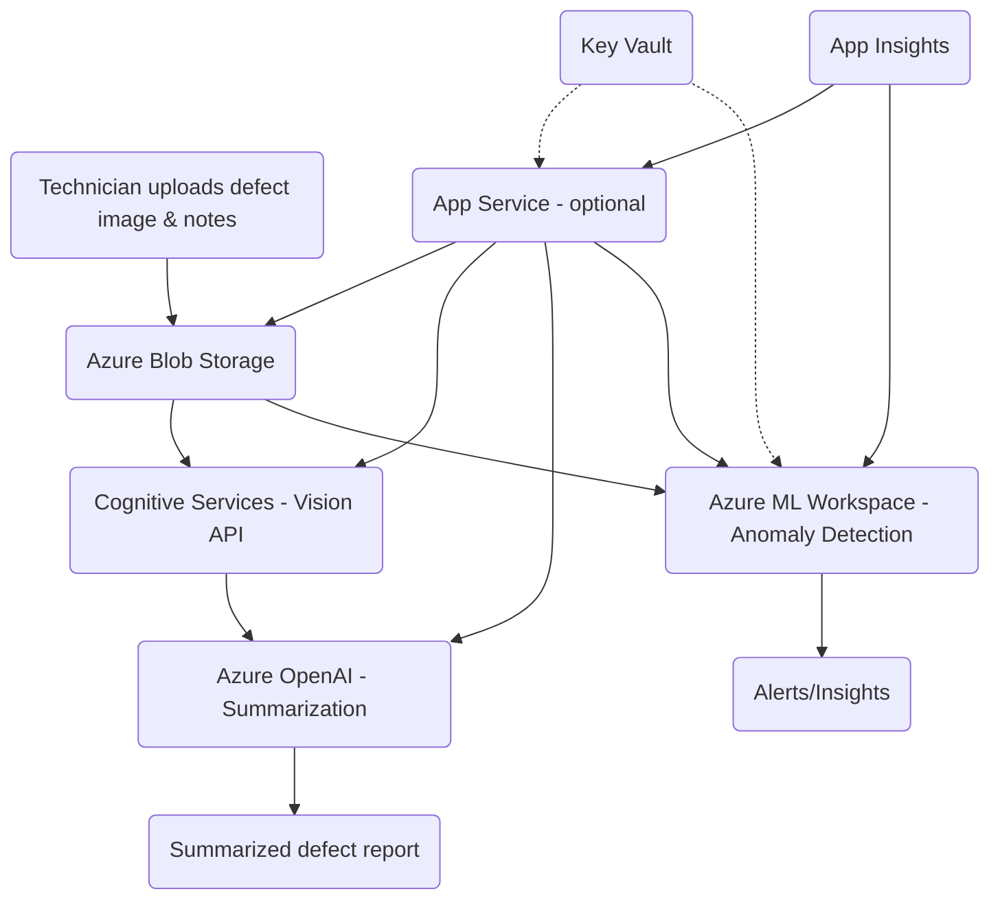
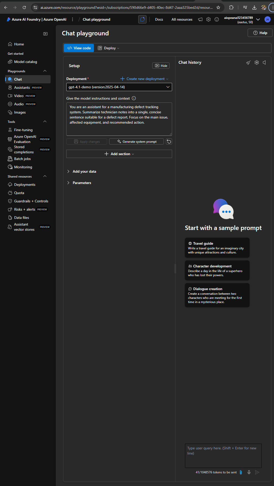
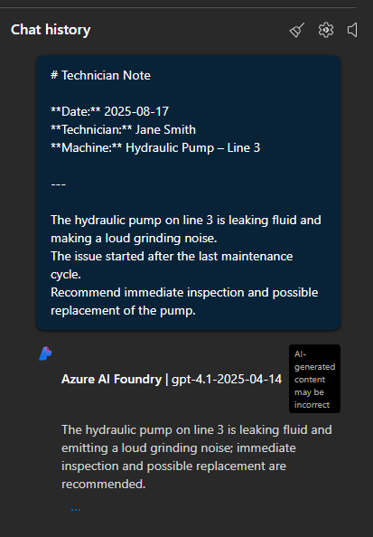
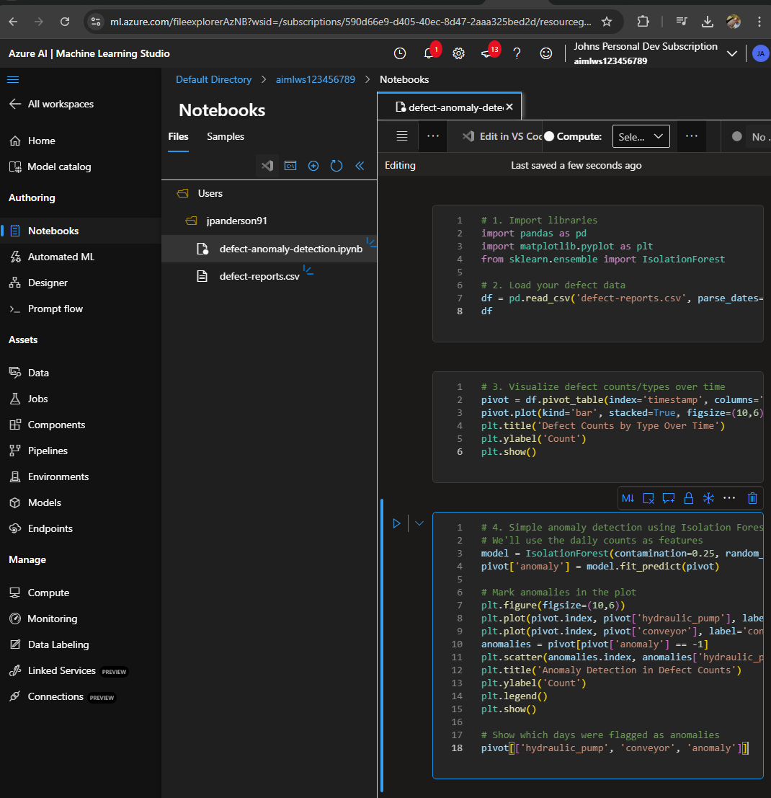
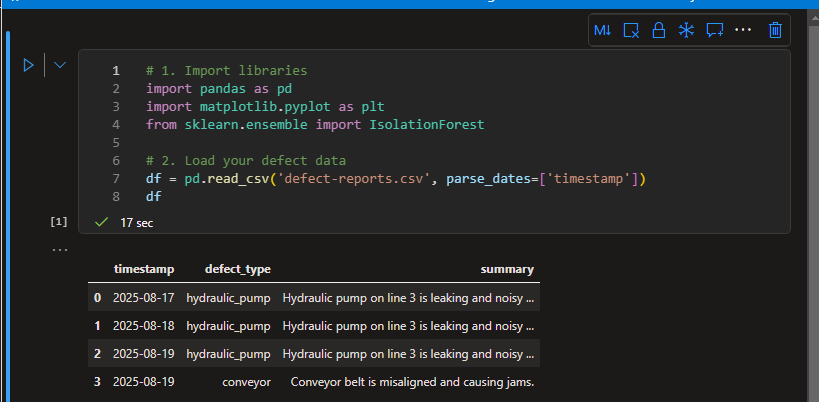
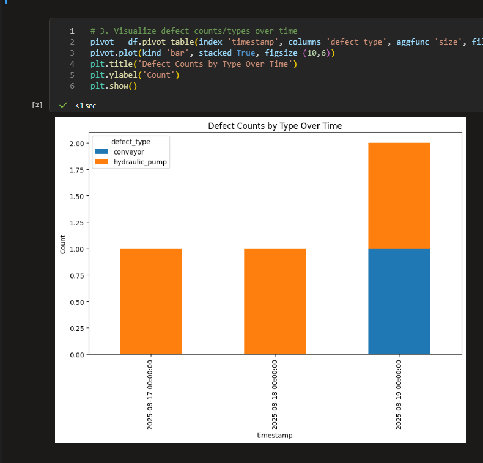
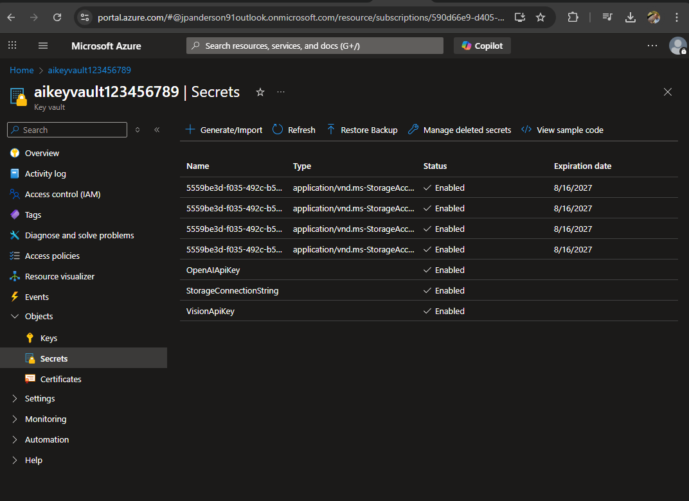

# Azure AI Integration Demo – Intelligent Defect Tracking for Manufacturing

## 🧠 Scenario Overview

This demo simulates a real-world engagement with a manufacturing customer who has developed an internal defect tracking application. The customer wants to enhance their solution by integrating Azure AI capabilities to:

- 📷 Analyze uploaded images of defective parts using **Azure Cognitive Services (Vision API)**
- 📝 Summarize technician notes using **Azure OpenAI (GPT-4)**
- ⚠️ Detect anomalies in defect patterns using a **custom ML model deployed via Azure ML**

As a Digital Solution Engineer, the goal is to guide the customer through secure, scalable integration of Azure AI into their existing application—accelerating productivity and unlocking new insights.

---

## 🏗️ Architecture Summary



| Component | Service | Purpose |
|----------|---------|---------|
| **Frontend App** | Azure Static Web Apps (optional) | Customer UI for defect submission |
| **Image Analysis** | Azure Cognitive Services – Vision API | Detect damage and classify part defects |
| **Text Summarization** | Azure OpenAI | Summarize technician notes for faster triage |
| **Anomaly Detection** | Azure ML | Flag unusual defect patterns using historical data |
| **Storage** | Azure Blob Storage | Store images and metadata securely |
| **Secrets Management** | Azure Key Vault | Secure API keys and connection strings |
| **Deployment** | ARM Templates | Infrastructure-as-code for repeatable setup |

---

## 📖 How This Solution Could Be Used

1. **Technician Submission:**  
   A technician uploads a photo of a faulty part and enters notes describing the issue using a simple upload interface.  
     
   After upload, the image appears in the `defect-images` container:  
   


2. **Automated Image Analysis:**  
   The technician’s uploaded image is automatically analyzed by Azure Cognitive Services (Vision API).  
   The screenshot below shows the API call and the AI-generated response, which includes:
   - **Tags:** The service identifies relevant features in the image (e.g., "device", "machine", "pipe", "engineering", "metal", etc.).
   - **Caption:** The AI generates a human-readable summary, such as "a close-up of a machine".

   

   The image analyzed in this step:  
   


3. **AI-Powered Summarization:**  
   The technician’s notes are sent to Azure OpenAI, which generates a concise summary for faster triage and reporting.

   *Sample technician note:*
   > The hydraulic pump on line 3 is leaking fluid and making a loud grinding noise. The issue started after the last maintenance cycle. Recommend immediate inspection and possible replacement of the pump.

   
   

   *Sample summary generated by OpenAI:*
   > The hydraulic pump on line 3 is leaking fluid and emitting a loud grinding noise; immediate inspection and possible replacement are recommended.


4. **Anomaly Detection:**  
   Defect data is ingested into Azure ML via a jupyter notebook, where a simple anomaly detection model (Isolation Forest) flags unusual patterns for review.

   
   
   
   

   *Example anomaly detection output:*
   > On 2025-08-19, an unusual increase in defects was detected, triggering an anomaly alert for further investigation.


5. **Secure & Monitored:**  
All secrets (API keys, connection strings) are managed in Key Vault. Application Insights provides monitoring and diagnostics for the solution.

**Key Vault:**  
Pre-requisites: 
To create and view secrets in Azure Key Vault:

- The Key Vault must be configured to use Azure RBAC for permissions.
- Your user account must have the "Key Vault Secrets Officer" or "Key Vault Administrator" role at the Key Vault scope.
- After assigning the role, wait a few minutes for permissions to propagate.
- You can then create secrets via Azure CLI or Portal, and view the list of secret names for documentation.

Secrets are securely stored and accessed by the application at runtime, never hard-coded.  


**Application Insights:**  
Real-time monitoring and diagnostics for the solution, including live metrics and smart detection of anomalies.  


**Smart Detection Example:**  
Automated alerts for unusual application behavior, enabling proactive troubleshooting.  


6. **App Service Ready for Integration:**  
   The App Service is provisioned and ready to host the defect tracking application or API.  
     
   

---

**Business Impact:**  
- Reduces manual effort for defect triage  
- Accelerates root cause analysis  
- Enables proactive quality improvements
---

## 🚀 Features

- End-to-end AI integration using Azure-native services
- Infrastructure deployed via **ARM templates**
- Modular backend for image and text processing
- Simulated customer scenario with clear business impact
- Ready for extension into real-world POCs or workshops

---

## 📂 Repository Structure

```plaintext
azure-ai-demo/
├── app/
│   └── backend/
│       └── README.md
├── arm-templates/
│   ├── app-service/
│   │   ├── mainTemplate.json
│   │   └── parameters.json
│   ├── cognitive-services/
│   │   ├── mainTemplate.json
│   │   ├── parameters.json
│   │   └── please help me with the Azure AI demo.md
│   ├── key-vault/
│   │   ├── mainTemplate.json
│   │   └── parameters.json
│   ├── ml-workspace/
│   │   ├── mainTemplate.json
│   │   └── parameters.json
│   ├── openai/
│   │   ├── mainTemplate.json
│   │   └── parameters.json
│   ├── resource-group/
│   │   └── mainTemplate.json
│   └── storage-account/
│       ├── mainTemplate.json
│       └── parameters.json
├── docs/
│   └── screenshots/
├── notebooks/
│   └── README.md
├── defect-reports.csv
├── sample-technician-note.md
└── README.md
```
